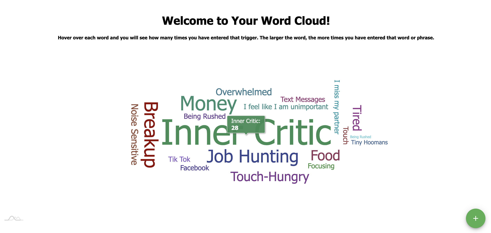

# Quiet The Bees

## Description

_Duration: 2 Week Sprint_

Staying organized in this information saturated world is next to
impossible - there are things to remember, to-do lists to make, recipes
to try, books to read, moods and energy to track...and if you have
anxiety or are neurodivergent, those thoughts can constantly be battling
for your attention - almost as if there was a hive of bees buzzing
noisily in your head!

We've all been there - you get frustrated by all those moving parts, so
you download this productivity app, that calender app, that mood tracker
app, or buy a new pretty planner. The fundamental flaw with these
products is that they were built for the "typical" brain...so we use it
for a few days, maybe a week, then forget about it. This app solves that
problem by providing one centralized location for all the those bees
flying around in your brain.

## Screen Shot

## Installation

- Create a database named prime_app,
- The queries in the database.sql file are set up to create all the necessary tables that you will need to have this app work correctly. The project is built on Postgres, so you will need to make sure to have that installed. I would recommend using Postico to run those queries as that was used to create the queries.
- Open up your editor of choice and run an "npm install"
- Run "npm run server" in your terminal.
- Open a section terminal and run "npm run client"
- A broswer should open automatically at localhost:3000 - enjoy the app!
## Built With

This appliciaton was made in two weeks with these technologies:
- React
- Redux
- Redux-Saga
- HTML
- CSS
- Javascript
- Node.js
- Express
- PostgreSQL
- am4charts
- Material-ui
- react-masonry-css

## Acknowledgement
Thanks to A huge shoutout to my instructor, Dane at [Prime Digital Academy](www.primeacademy.io) for downloading all this code into my brain and for talking things out with me when the bees buzzed too loud.

And to my co-parent and partner, Isaac - thank you for being you. Word cannot express how thankful I am that you were willing to take the large brunt of parenting our tiny hoomans while I furthered my career.

## Support
If you have suggestions or issues, please email me at [mary.mettille.brist@gmail.com]
